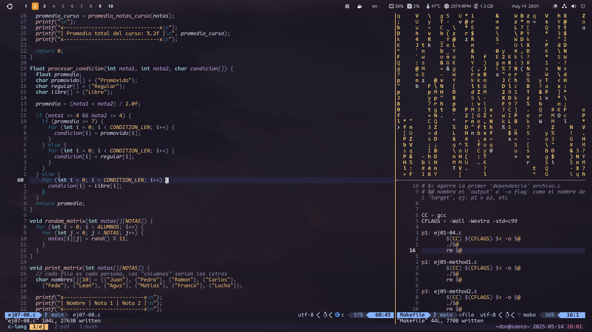

# dotfiles

- OS: [**Ubuntu 24.04.1 LTS**](https://releases.ubuntu.com/jammy/)
- Window Manager: Undecided, currently GNOME
- Compositor: [**Wayland**](https://wayland.freedesktop.org/)
- Terminal: [**Tmux**](https://github.com/tmux/tmux/wiki), [**Ghostty**](https://ghostty.org/)
- Browser: [**Zen Browser**](https://zen-browser.app/)
- Menu: [**Wofi**](https://github.com/SimplyCEO/wofi)
- Docs: [**Zathura**](https://github.com/pwmt/zathura)
- File manager: [**Yazi**](https://yazi-rs.github.io/) 
- Text editor: [**Neovim**](https://neovim.io/), [**Cursor**](https://www.cursor.com/), [**Windsurf**](https://windsurf.com/editor)

---

## To do
